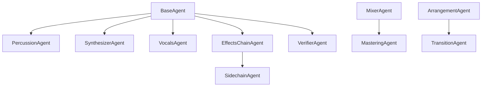

# Agent Inventory Analysis

> Analysis Date: 2025-12-16
> Source: `scripts/dearpygui_controller/agents/`

## Overview

**Total Agents**: 22 specialized agents + 1 base class
**Architecture**: All inherit from `BaseAgent` ABC
**LLM Integration**: Ollama (llama3) at localhost:11434

## Agent Categories

### 🎵 Core Music Production Agents

| Agent | Role | Goal | Stem Target |
|-------|------|------|-------------|
| `PercussionAgent` | Percussionist | Drum rack, tribal rhythms, glitch | Drums |
| `SynthesizerAgent` | Synth Programmer | FM/Wavetable synthesis | Others |
| `VocalsAgent` | Vocal Producer | Vocal processing, vocoder | Vocals |
| `ComposerAgent` | Composer | Chord progressions, melodies | Others |

### 🔊 Effects & Mixing Agents

| Agent | Role | Goal | Stem Target |
|-------|------|------|-------------|
| `EffectsChainAgent` | Mix Engineer | Sidechain, multi-band, Roar | All |
| `MixerAgent` | Mixer | Levels, panning, bus routing | Full Mix |
| `MasteringAgent` | Mastering Eng. | Loudness, limiting, EQ | Full Mix |
| `SidechainAgent` | Specialist | Sidechain compression routing | Bass/Others |

### 🎛️ Sound Design Agents

| Agent | Role | Goal | Stem Target |
|-------|------|------|-------------|
| `SoundDesignAgent` | Sound Designer | Synth programming, FX | Others |
| `SamplerAgent` | Sampler Specialist | Sample chopping, mapping | Drums |
| `ModulationAgent` | LFO/Mod Specialist | Automation curves | All |
| `GrooveAgent` | Groove Producer | Swing, humanization | Drums |

### 🏗️ Arrangement Agents

| Agent | Role | Goal | Stem Target |
|-------|------|------|-------------|
| `ArrangementAgent` | Arranger | Song structure, sections | Full Song |
| `ArrangerAgent` | Arranger (alt) | Clip arrangement | Full Song |
| `TransitionAgent` | Transition Designer | Builds, drops, risers | Full Song |
| `AutomationAgent` | Automation | Parameter automation | All |

### 🔧 Utility Agents

| Agent | Role | Goal |
|-------|------|------|
| `VerifierAgent` | QA Engineer | Validate completion criteria |
| `BrowserAgent` | Browser Navigator | Find instruments/samples |
| `ResearchAgent` | Researcher | Search docs/techniques |
| `ReturnTrackAgent` | Specialist | Send/return routing |

## Agent Architecture

### BaseAgent (Abstract)

```python
class BaseAgent(ABC):
    def __init__(
        self,
        name: str = "BaseAgent",
        verbose: bool = True,
        ollama_model: str = "llama3",
        ollama_base_url: str = "http://localhost:11434",
    ):
        ...

    def get_mcp_client(self) -> AbletonMCPClient
    async def execute(self, **kwargs) -> AgentResult
    def get_role(self) -> str
    def get_goal(self) -> str
```

### AgentResult

```python
@dataclass
class AgentResult:
    success: bool
    message: str = ""
    data: dict[str, Any] = field(default_factory=dict)
    errors: list[str] = field(default_factory=list)
```

## Stem Mapping Analysis

### Drums Stem → Agents

| Agent | Contribution |
|-------|--------------|
| `PercussionAgent` | Tom/glitch/ride patterns |
| `SamplerAgent` | Drum sample selection |
| `GrooveAgent` | Swing/humanization |

### Bass Stem → Agents

| Agent | Contribution |
|-------|--------------|
| `SynthesizerAgent` | FM bass programming |
| `SidechainAgent` | Pump to kick |
| `EffectsChainAgent` | Saturation via Roar |

### Vocals Stem → Agents

| Agent | Contribution |
|-------|--------------|
| `VocalsAgent` | Main vocal chain |
| `EffectsChainAgent` | Vocoder, glitch FX |

### Others Stem → Agents

| Agent | Contribution |
|-------|--------------|
| `SynthesizerAgent` | Synth stabs, leads |
| `SoundDesignAgent` | Textures, pads |
| `ComposerAgent` | Chord progressions |

## Missing Agents for Stem Comparison

### Proposed: StemComparisonAgent

```python
class StemComparisonAgent(BaseAgent):
    """Compare recreated tracks against original stems."""

    async def execute(
        self,
        original_stem_path: str,
        recreated_track_index: int,
        metric: str = "spectral_similarity"
    ) -> AgentResult:
        # 1. Export track audio
        # 2. Load original stem
        # 3. Compute spectral similarity (librosa)
        # 4. Ask Ollama to interpret differences
        # 5. Return score + suggestions
```

### Proposed: StemExtractionAgent

```python
class StemExtractionAgent(BaseAgent):
    """Extract stems from source audio using Ableton 12.3."""

    async def execute(
        self,
        audio_path: str,
        quality: str = "high"
    ) -> AgentResult:
        # 1. Import audio to Ableton
        # 2. Trigger stem separation
        # 3. Wait for completion
        # 4. Return stem file paths
```

## Agent Dependencies



## Ollama Integration Points

All agents inherit Ollama configuration from `BaseAgent`:

```python
ollama_model: str = "llama3"
ollama_base_url: str = "http://localhost:11434"
```

**Current Usage**: Limited - mostly for logging/progress
**Potential Usage**:
1. Interpret spectral differences
2. Suggest parameter adjustments
3. Generate pattern variations
4. Describe sound characteristics

## Agent Quality Scores

From `scripts/validators/agent_quality_validator.py`:

| Metric | Weight | Description |
|--------|--------|-------------|
| TDD Markers | 15% | @pytest markers present |
| AAA Pattern | 25% | Arrange/Act/Assert structure |
| Manual Refs | 20% | Ableton documentation links |
| Type Hints | 15% | Proper typing |
| Docstrings | 25% | Documentation coverage |

## Recommendations

### High Priority
1. Create `StemComparisonAgent` for validation loop
2. Add librosa integration to `VerifierAgent`
3. Enhance Ollama usage for interpretation

### Medium Priority
1. Standardize all agents using Ableton Manual refs
2. Add comprehensive type hints
3. Create agent chaining/orchestration

### Low Priority
1. GUI improvements in dearpygui_controller
2. Progress callback standardization
3. Agent state persistence
