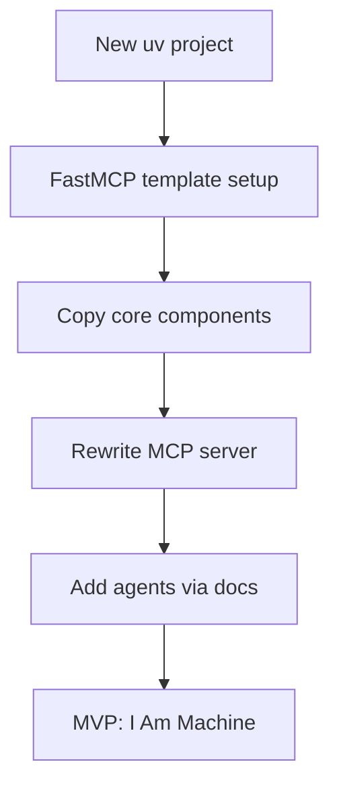
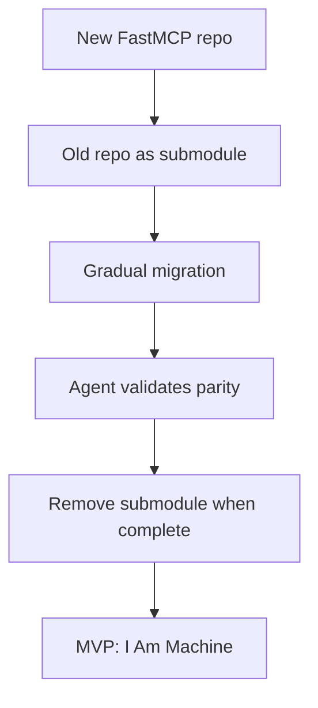
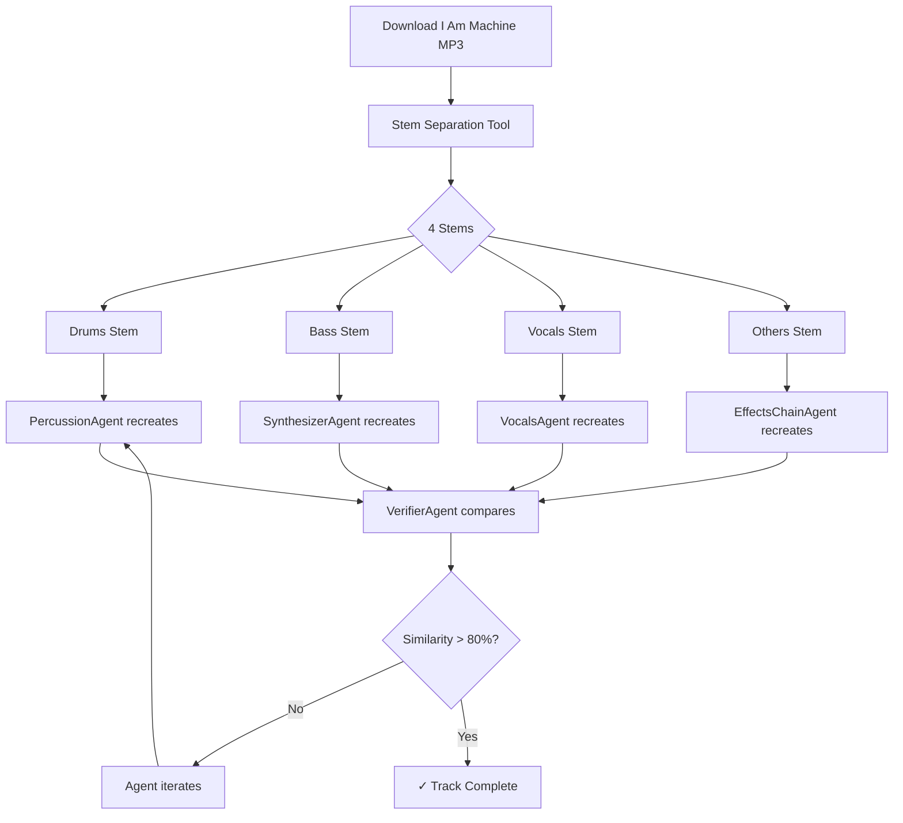

# Project Migration Options for ableton-mcp → ableton-fastmcp

## Problem Statement

Current repository has grown large and "doesn't work that great." Need to decide:
1. Continue in current repo with refactoring
2. Create fresh `ableton-fastmcp` using FastMCP best practices
3. Hybrid approach

**MVP Objective**: Recreate "Lily Palmer - I Am Machine" in Ableton Live 12.3

---

## 3 Options for Agentic Workflow with Documentation

### Option A: Incremental Refactor (Keep Current Repo)

**Strategy**: Use Antigravity + docs to systematically refactor in-place.

```mermaid
graph TD
    A[Current Repo] --> B[/research cleanup strategy]
    B --> C[Create refactor task list]
    C --> D[Agent-driven refactoring]
    D --> E[Test & validate]
    E --> F[MVP: I Am Machine]
```

**Workflow**:
1. `/research "Python project refactoring best practices"`
2. Create `task.md` with cleanup checklist using [.antigravity/docs/task-list.md](file:///Users/alexzh/ableton-mcp/.antigravity/docs/task-list.md)
3. Use Gemini CLI headless mode for batch refactoring
4. Validate with existing tests

**Pros**:
- No migration overhead
- Preserve git history
- Existing tests still valid

**Cons**:
- Tech debt accumulates
- Harder to adopt FastMCP patterns
- Complex dependency graph

**Code to Keep** (in-place):
| Directory | Purpose | Action |
|-----------|---------|--------|
| `scripts/ableton_cache_ast_codegen_mcp/` | MCP server | Refactor to FastMCP |
| `scripts/dearpygui_controller/` | GUI + agents | Keep, improve agents |
| `scripts/validators/` | Quality validation | Keep as-is |
| `tests/agents/` | Agent tests | Expand coverage |

---

### Option B: Clean Slate (New `ableton-fastmcp` Repo)

**Strategy**: Create new uv project with FastMCP template, migrate only essential code.



**Workflow**:
1. `uv init ableton-fastmcp --python 3.12`
2. `uv add fastmcp[standard]`
3. Use Claude CLI: `claude "Create FastMCP server structure based on gofastmcp.com patterns" -d .`
4. Copy validated components from old repo
5. Use `.gemini/docs/mcp.md` patterns for MCP development

**New Project Structure**:
```
ableton-fastmcp/
├── .antigravity/docs/       # Copy docs
├── .claude/                  # Copy config
├── .gemini/docs/             # Copy docs
├── src/
│   ├── server.py             # FastMCP server
│   ├── tools/                # MCP tools
│   │   ├── session.py
│   │   ├── tracks.py
│   │   └── devices.py
│   └── resources/            # MCP resources
├── agents/                   # From dearpygui_controller/agents
├── tests/
├── pyproject.toml
└── GEMINI.md
```

**Migration Checklist**:
- [ ] Core MCP tools (session, tracks, devices)
- [ ] Agent implementations (from `dearpygui_controller/agents/`)
- [ ] Quality validators (from `scripts/validators/`)
- [ ] Embedding/search code (from `ableton_cache_ast_codegen_mcp/`)

**Pros**:
- Clean architecture from start
- FastMCP best practices built-in
- Smaller, focused codebase
- Modern uv tooling

**Cons**:
- Lose git history
- Migration effort
- Risk of missing edge cases

---

### Option C: Hybrid (Git Submodule + New FastMCP)

**Strategy**: Keep old repo as reference, create new FastMCP primary repo.



**Workflow**:
1. Create `ableton-fastmcp` fresh
2. Add old repo as submodule: `git submodule add ../ableton-mcp legacy/`
3. Use agent to compare & migrate:
   ```
   USER: Compare legacy/scripts/ableton_cache_ast_codegen_mcp/mcp_server.py
         with new src/server.py - ensure feature parity
   ```
4. Reference `.gemini/docs/mcp.md` for FastMCP patterns
5. Validate with both test suites

**Structure**:
```
ableton-fastmcp/
├── src/                      # New FastMCP code
├── agents/                   # Migrated agents
├── tests/
├── legacy/                   # Git submodule → ableton-mcp
│   └── (read-only reference)
├── migration/
│   └── status.md             # Track what's migrated
└── pyproject.toml
```

**Pros**:
- Best of both worlds
- Can reference old code during development
- Gradual, validated migration
- Keep git history in submodule

**Cons**:
- More complex setup
- Two repos to manage temporarily
- Need to sync docs

---

## Recommendation: Option C (Hybrid)

**Why**: Provides safety net while building properly. The submodule lets you:
1. Reference working code while rewriting
2. Run comparative tests
3. Gradually validate migration

---

## Agentic Workflow Using Documentation

### Phase 1: Setup (Week 1)

```bash
# Create new project
uv init ableton-fastmcp --python 3.12
cd ableton-fastmcp
uv add "fastmcp[standard]" "anthropic" "pytest" "pytest-asyncio"

# Copy documentation
cp -r ../ableton-mcp/.antigravity/docs .antigravity/
cp -r ../ableton-mcp/.claude/docs .claude/
cp -r ../ableton-mcp/.gemini/docs .gemini/

# Add legacy submodule
git submodule add ../ableton-mcp legacy
```

### Phase 2: Core Server (Week 2)

Use agents with documentation:
```
USER: @.gemini/docs/mcp.md Create a FastMCP server following these patterns.
      Reference legacy/scripts/ableton_cache_ast_codegen_mcp/mcp_server.py
      for the tool implementations.
```

### Phase 3: Agent Migration (Week 3)

```
USER: @.claude/docs/agent-mode.md Migrate agents from legacy/scripts/dearpygui_controller/agents/
      to new agents/ directory. Use TDD - write tests first.
```

### Phase 4: MVP Execution (Week 4)

```
USER: Using our new FastMCP server, recreate "Lily Palmer - I Am Machine"
      following the patterns in legacy/live_set/lily_palmer/i_am_machine/
```

---

## Verification Plan

### Automated Tests
1. **Unit tests**: `pytest tests/unit/ -v`
2. **Integration tests**: `pytest tests/integration/ -v --timeout=60`
3. **MCP tool tests**: `pytest tests/tools/ -v`

### Manual Verification
1. Start Ableton Live 12.3
2. Run `make check-port` to verify connection
3. Execute: `python -m src.server` to start FastMCP server
4. Use Antigravity IDE to test MCP tools interactively

---

---

## NEW: Stem Separation MCP Tool + Agent Workflow

### Ableton Live 12.3 Suite Features to Leverage

| Feature | Purpose |
|---------|---------|
| **Stem Separation** | Extract Vocals/Drums/Bass/Others from "I Am Machine" MP3 |
| **Roar** | Saturation device for coloring bass/synth tracks |

### Stem Separation MCP Tool Design

```python
# tools/stem_separation.py (FastMCP pattern)
from fastmcp import FastMCP

mcp = FastMCP("ableton-stems")

@mcp.tool()
async def separate_stems(
    clip_path: str,
    stems: list[str] = ["Vocals", "Drums", "Bass", "Others"],
    quality: str = "high"  # "high" or "speed"
) -> dict:
    """Separate audio clip into stems using Live 12.3.

    Returns:
        paths: dict mapping stem name to file path
        group_track_index: index of new group track
    """
    # Trigger Ableton's stem separation via Remote Script
    pass

@mcp.tool()
async def compare_stem_to_track(
    stem_path: str,
    track_index: int,
    metric: str = "spectral_similarity"
) -> dict:
    """Compare extracted stem to recreated track.

    Metrics: spectral_similarity, rms_difference, harmonic_content
    """
    pass
```

### Agent Workflow for I Am Machine Recreation



### Existing Agents to Use (from `dearpygui_controller/agents/`)

| Agent | Purpose | Stem Target |
|-------|---------|-------------|
| `PercussionAgent` | Recreate kick/snare/hi-hat | Drums stem |
| `SynthesizerAgent` | Recreate synth leads | Others stem |
| `VocalsAgent` | Recreate vocal processing | Vocals stem |
| `EffectsChainAgent` | Effects with Roar device | All stems |
| `VerifierAgent` | Compare output to stems | Validation |
| `MixerAgent` | Final mix matching | Full song |

### Ollama Integration (Base Agent Pattern)

```python
# From base_agent.py - all agents use this pattern
class BaseAgent(ABC):
    def __init__(
        self,
        ollama_model: str = "llama3",  # Local LLM
        ollama_base_url: str = "http://localhost:11434",
    ):
        ...
```

### New: StemComparisonAgent

```python
class StemComparisonAgent(BaseAgent):
    """Compare recreated tracks against original stems.

    Uses librosa for spectral analysis and Ollama for
    interpreting differences and suggesting improvements.
    """

    async def execute(
        self,
        original_stem_path: str,
        recreated_track_index: int,
    ) -> AgentResult:
        # 1. Export track audio via MCP
        # 2. Compare spectrums using librosa
        # 3. Ask Ollama to interpret differences
        # 4. Return similarity score + suggestions
        pass
```

---

## Updated Phased Implementation

### Phase 1: Setup + Stem Extraction (Week 1)

1. Download "I Am Machine" audio (YouTube → MP3)
2. Create `separate_stems` MCP tool
3. Extract 4 stems using Ableton 12.3
4. Store at `stems/i_am_machine/{drums,bass,vocals,others}.wav`

### Phase 2: Agent Pipeline (Week 2)

1. Port existing agents to FastMCP codebase
2. Create `StemComparisonAgent`
3. Wire agents to use stem files as reference

### Phase 3: Track Recreation Loop (Weeks 3-4)

```
for stem in [drums, bass, vocals, others]:
    while similarity < 0.8:
        track = create_track(stem.type)
        score = compare_stem_to_track(stem, track)
        if score < 0.8:
            suggestions = ollama_analyze_difference(stem, track)
            apply_suggestions(track, suggestions)
```

### Phase 4: Mix & Master (Week 5)

1. Use `MixerAgent` for level matching
2. Use `MasteringAgent` for final polish
3. Use `VerifierAgent` for full-song comparison

---

## User Review Required

> [!IMPORTANT]
> **Decisions needed**:
> 1. Which migration option? (A/B/C) — **Recommend C (Hybrid)**
> 2. Start with which stem? **Recommend Drums** (most structured)
> 3. Similarity threshold? **Recommend 80%** starting point

> [!NOTE]
> - Stem Separation requires Ableton Live 12.3 Suite (you have it ✓)
> - Roar device unlocked for saturation effects ✓
> - YouTube link: https://www.youtube.com/watch?v=FCgeVETZBYg
