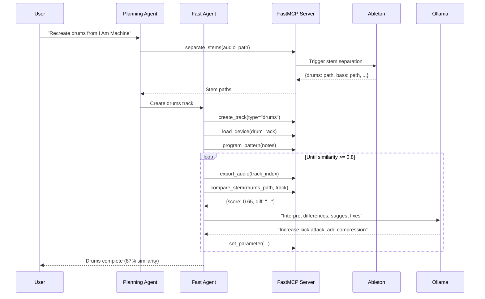

# Product Requirements Document (PRD)

## Project: I Am Machine Recreation via Agentic Workflow

> Version: 1.0 DRAFT
> Date: 2025-12-16
> Status: ANALYSIS PHASE

---

## 1. Executive Summary

### 1.1 Vision
Recreate "Lily Palmer - I Am Machine" in Ableton Live 12.3 using AI-driven agentic workflows that compare recreated tracks against extracted stems for iterative improvement.

### 1.2 MVP Scope
- Extract stems from original track (Drums/Bass/Vocals/Others)
- Use specialized agents to recreate each stem
- Compare recreated audio against original stems
- Iterate until similarity threshold (80%) is reached

---

## 2. User Stories

### US-001: Stem Extraction
**As a** music producer
**I want** to extract stems from an MP3 using Ableton 12.3's built-in feature
**So that** I can analyze and recreate individual elements

**Acceptance Criteria:**
- [ ] MP3 imports to Ableton session
- [ ] Stem separation creates 4 tracks (Drums/Bass/Vocals/Others)
- [ ] Stems exported as WAV files
- [ ] MCP tool returns file paths

### US-002: Track Recreation with Agent
**As a** music producer
**I want** an AI agent to recreate a specific stem
**So that** I can match the original sound programmatically

**Acceptance Criteria:**
- [ ] Agent analyzes stem characteristics
- [ ] Agent creates corresponding track with devices
- [ ] Agent programs MIDI patterns or loads samples
- [ ] Track exports for comparison

### US-003: Similarity Comparison
**As a** music producer
**I want** to compare my recreated track against the original stem
**So that** I know how close I am to the original

**Acceptance Criteria:**
- [ ] Spectral analysis of both audio files
- [ ] Similarity score returned (0.0 - 1.0)
- [ ] Difference description from Ollama
- [ ] Improvement suggestions generated

### US-004: Iterative Improvement
**As a** music producer
**I want** the agent to automatically refine the track
**So that** it progressively matches the original

**Acceptance Criteria:**
- [ ] Agent receives comparison results
- [ ] Agent adjusts parameters based on suggestions
- [ ] Process repeats until threshold met
- [ ] Final track achieves 80%+ similarity

---

## 3. Functional Requirements

### FR-001: Stem Separation MCP Tool
| Requirement | Description |
|-------------|-------------|
| Input | Audio file path, quality setting |
| Output | Dict of stem paths, group track index |
| Dependencies | Ableton Live 12.3 Suite, Control Surface |
| Performance | High quality: ~2 min, Speed: ~30 sec |

### FR-002: Track Comparison MCP Tool
| Requirement | Description |
|-------------|-------------|
| Input | Stem path, track index, metric type |
| Output | Similarity score, difference analysis |
| Dependencies | librosa, numpy |
| Metrics | spectral_similarity, rms_difference, har harmonic_content |

### FR-003: Agent Orchestration
| Requirement | Description |
|-------------|-------------|
| Workflow | Sequential stem processing |
| Parallelism | One agent per stem (future) |
| Retry Logic | Max 5 iterations per stem |
| Threshold | 80% similarity to pass |

---

## 4. Non-Functional Requirements

### NFR-001: Performance
- Stem extraction: < 3 minutes
- Track comparison: < 5 seconds
- Agent iteration: < 30 seconds

### NFR-002: Reliability
- Graceful handling of Ableton connection loss
- Agent state persistence between iterations
- Automatic retry on tool failures

### NFR-003: Observability
- Progress callbacks for GUI
- Logging of all agent decisions
- Similarity history tracking

---

## 5. Technical Architecture

### 5.1 High-Level Architecture

```
┌─────────────────────────────────────────────────────────────────┐
│                    Antigravity IDE                              │
│  ┌─────────────────┐  ┌─────────────────┐  ┌─────────────────┐ │
│  │  Planning Agent │  │  Fast Agent     │  │  Browser Agent  │ │
│  └────────┬────────┘  └────────┬────────┘  └────────┬────────┘ │
└───────────┼──────────────────────────────────────────────────────┘
            │
            ▼
┌─────────────────────────────────────────────────────────────────┐
│                    ableton-fastmcp Server                        │
│  ┌────────────────┐  ┌────────────────┐  ┌────────────────┐     │
│  │ separate_stems │  │ create_track   │  │ compare_stem   │     │
│  └────────────────┘  └────────────────┘  └────────────────┘     │
│  ┌────────────────┐  ┌────────────────┐  ┌────────────────┐     │
│  │ load_device    │  │ set_parameter  │  │ export_audio   │     │
│  └────────────────┘  └────────────────┘  └────────────────┘     │
└───────────────────────────────┬─────────────────────────────────┘
                                │ Socket (9877)
                                ▼
┌─────────────────────────────────────────────────────────────────┐
│                    Ableton Live 12.3 Suite                       │
│  ┌──────────────────────────────────────────────────────────┐   │
│  │  AbletonMCP Control Surface (Remote Script)               │   │
│  └──────────────────────────────────────────────────────────┘   │
│  ┌──────────┐  ┌──────────┐  ┌──────────┐  ┌──────────────┐    │
│  │ Session  │  │ Tracks   │  │ Devices  │  │ Stem Separate│    │
│  └──────────┘  └──────────┘  └──────────┘  └──────────────┘    │
└─────────────────────────────────────────────────────────────────┘
```

### 5.2 Agent Workflow



---

## 6. Risk Assessment

### 6.1 Technical Risks

| Risk | Probability | Impact | Mitigation |
|------|-------------|--------|------------|
| Stem separation not accessible via Remote Script | Medium | High | Manual extraction as fallback |
| Spectral similarity not correlating to perceptual quality | Medium | Medium | Multiple metrics, human review |
| Ollama suggestions not actionable | Low | Medium | Template-based suggestions |
| Ableton connection instability | Low | High | Retry logic, state persistence |

### 6.2 Scope Risks

| Risk | Probability | Impact | Mitigation |
|------|-------------|--------|------------|
| 80% threshold not achievable | Medium | High | Adjust threshold based on stem |
| Vocals too complex to recreate | High | Medium | Focus on instrumental stems first |
| Others stem too varied | High | Medium | Sub-categorize using analysis |

---

## 7. Decision Log

### DEC-001: Migration Approach
**Options:**
- A: Incremental refactor in current repo
- B: Clean slate with new ableton-fastmcp
- C: Hybrid with git submodule

**Analysis Pending:**
- [ ] LOC count for components to migrate
- [ ] Test coverage of current agents
- [ ] FastMCP feature completeness check

**Recommended**: Option C (Hybrid)

### DEC-002: Starting Stem
**Options:**
- Drums (most structured, easiest to analyze)
- Bass (critical for genre, defined frequency range)
- Others (most creative latitude)
- Vocals (most complex)

**Recommended**: Drums (start with most constrained problem)

### DEC-003: Similarity Metric
**Options:**
- Spectral similarity (FFT-based)
- RMS envelope matching
- Harmonic content analysis
- All combined (weighted)

**Recommended**: Start with spectral similarity, add others iteratively

---

## 8. Open Questions

1. **Stem Separation API**: Can Ableton's stem separation be triggered programmatically via Remote Script, or is it UI-only?

2. **Export API**: How do we export audio from a specific track via MCP for comparison?

3. **Ollama Model**: Is llama3 sufficient for music production suggestions, or should we use a specialized model?

4. **Similarity Threshold**: Is 80% a realistic target? What does 80% perceptually mean?

5. **Vocals Strategy**: Should we attempt vocal recreation or treat as sample-based?

---

## 9. Next Steps

### Research Phase (Current)
- [x] Analyze existing agents
- [x] Research FastMCP patterns
- [ ] Test stem separation via Remote Script
- [ ] Benchmark similarity metrics on known audio
- [ ] Prototype StemComparisonAgent

### Design Phase
- [ ] Finalize migration decision (A/B/C)
- [ ] Design FastMCP server structure
- [ ] Design agent orchestration flow
- [ ] Create test plan

### Implementation Phase
- [ ] Set up new project (if Option B/C)
- [ ] Implement stem separation tool
- [ ] Implement comparison tool
- [ ] Port agents to new structure
- [ ] Integration testing
