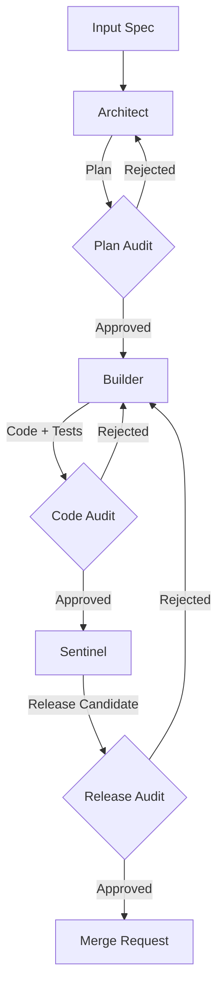

# Antigravity Agents

The Ableton MCP project utilizes a specialized multi-agent system designed for autonomous software development. These agents operate within the `feature/0007-agentic-workspace` workflow.

## Core Agents

### 1. Architect (The Planner)
**Role**: Strategic planning and System Design
**Responsibilities**:
- Reads and analyzes input specifications (specs, docs)
- Generates detailed implementation plans (`implementation_plan`)
- Makes high-level architectural decisions
- **Tools**: Google Drive (Read), File System (Read), Thinking

### 2. Critic (The Auditor)
**Role**: Quality Assurance and Security Audit
**Responsibilities**:
- Reviews output at three critical gates:
  1. **Plan Audit**: Validates the Architect's plan against the spec
  2. **Code Audit**: Reviews the Builder's implementation for quality, security, and standards
  3. **Release Audit**: Final verification before merging
- **Tools**: File System (Read), Thinking

### 3. Builder (The Implementer)
**Role**: Code Construction and TDD
**Responsibilities**:
- Executes the approved implementation plan
- Follows Test-Driven Development (TDD) cycle:
  - Writes failing tests
  - Implements code to pass tests
  - Refactors for quality
- Uses AST-based context splitting to manage large files efficiently
- **Tools**: File System (Read/Write), Terminal (Run Tests), AST Tools

### 4. Sentinel (The Guardian)
**Role**: Release Management and Integration
**Responsibilities**:
- Verifies the final state of the codebase
- Runs comprehensive regression tests
- Manages Git operations (commit, push, PR creation)
- Ensures all documentation is updated
- **Tools**: Git CLI, Terminal, File System (Write), GitHub Actions/API

## Workflow Architecture

The agents operate in a **Spec-Driven Loop** with strict audit gates:



## Infrastructure

The agentic workspace is powered by:
- **Redis Stack**: Persists agent memory, context, and audit logs.
- **MCP Redis**: Bridges the Antigravity IDE to the local Redis instance.
- **Docker**: Provides the containerized runtime environment.

To start the infrastructure:
```bash
docker compose up -d
```
