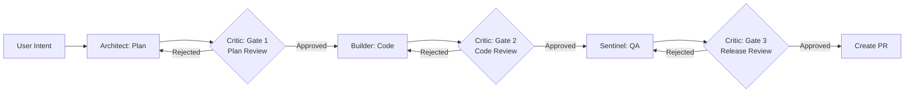

# Agentic Workflow Guide

## Overview

The Ableton MCP project implements a "Day 2" autonomous development loop following Google Agentic Design Patterns. This workflow uses a **Multi-Gate Audit** strategy to prevent "Agent Drift" and architectural violations before they reach production.

## Architecture

### Four Specialized Agents

1. **Architect** (Planner)
   - Reads design specs from Google Drive
   - Generates implementation plans
   - Defines success criteria and TDD plans
   - Tools: Google Workspace, Redis MCP

2. **Critic** (Auditor)
   - Reviews at three gates: Plan → Code → Release
   - Checks for over-engineering, security risks, hardcoded secrets
   - Validates code matches plan and follows "stupid simple" principle
   - Tools: UV, Redis MCP, Git diff

3. **Builder** (Implementation)
   - Executes approved build plans via strict TDD
   - Iterates based on Critic feedback
   - Uses AST context splitting for 40% token reduction
   - Tools: Editor, Shell (auto-run), UV, Redis MCP

4. **Sentinel** (QA & Release)
   - Runs parallel pytest verification
   - Creates PR drafts matching original specs
   - Tools: Shell, Git, GitHub

### Multi-Gate Audit Pattern



Each gate allows up to 3 retry attempts before halting the pipeline.

## Infrastructure Setup

### Prerequisites

- Docker Desktop installed and running
- Python 3.12+
- UV package manager (recommended)

### Quick Start

1. **Start local infrastructure:**
   ```bash
   docker-compose up -d
   ```

2. **Verify services:**
   ```bash
   # Check containers are running
   docker-compose ps

   # Test Redis connectivity
   docker exec -it redis-stack redis-cli PING
   # Should return: PONG

   # Check MCP Redis logs
   docker logs mcp-redis
   ```

3. **Access Redis Stack UI:**
   - Open http://localhost:8001 in your browser
   - View agent memory, audit logs, and cached plans

### Configuration Files

- `docker-compose.yml`: Redis Stack + MCP Redis bridge
- `.antigravity/extensions.json`: Workspace integrations (Google, GitHub)
- `.antigravity/workflows/spec_driven_loop.py`: Main workflow implementation

## Developer CLI Reference

### Shell Aliases

Add these to your `~/.zshrc` or `~/.bashrc`:

```bash
# Trigger the full workflow loop
alias g-feature="gemini run workflow 'Feature: Multi-Gate Agent Loop (v7)' --input"

# Inspect agent memory (current plan draft)
alias g-status="docker exec -it redis-stack redis-cli JSON.GET plan:current:draft"

# View audit logs (see why Critic rejected code)
alias g-audit="docker exec -it redis-stack redis-cli LRANGE audit:log 0 -1"

# Force a manual critique
alias g-critique="gemini agent run Critic --input 'Review local changes'"
```

### Usage Examples

**Start a new feature:**
```bash
g-feature "Add MIDI velocity randomization to drum patterns"
```

**Check current workflow status:**
```bash
g-status
```

**Review why code was rejected:**
```bash
g-audit
```

**Manually trigger code review:**
```bash
g-critique
```

## Redis Memory Inspection

### Useful Redis Commands

```bash
# View all keys
docker exec -it redis-stack redis-cli KEYS '*'

# Get current plan
docker exec -it redis-stack redis-cli JSON.GET plan:current:draft

# View last 10 audit log entries
docker exec -it redis-stack redis-cli LRANGE audit:log 0 9

# Check Critic rejection count
docker exec -it redis-stack redis-cli GET critic:rejections:count

# View specific artifact
docker exec -it redis-stack redis-cli JSON.GET artifact:implementation_plan:latest
```

### Data Structure

The workflow stores data in Redis with the following key patterns:

- `plan:current:draft` - Current implementation plan (JSON)
- `audit:log` - List of all Critic reviews
- `artifact:*` - Cached artifacts (plans, diffs, PR drafts)
- `critic:rejections:*` - Rejection tracking per stage

## Context Optimization

### AST Context Splitting

The Builder agent uses AST context splitting at "definition" granularity:
- Reduces token usage by ~40%
- Resolves imports automatically
- Provides only relevant code context

### Context Caching

All agent system prompts use `<context_caching_prefix>` tags to enable Gemini API context caching, reducing latency and costs.

### Local Repo Index

The Builder has read-only access to `external/` directory for reference without including it in editable context.

## Troubleshooting

### Docker Issues

**Containers not starting:**
```bash
docker-compose down
docker-compose up -d --force-recreate
```

**Port conflicts (6379 or 8001 in use):**
```bash
# Find process using port
lsof -i :6379
lsof -i :8001

# Kill the process or change ports in docker-compose.yml
```

### Redis Connection Issues

**MCP Redis can't connect:**
```bash
# Check Redis Stack is running
docker exec -it redis-stack redis-cli PING

# Restart MCP Redis
docker-compose restart mcp-redis
```

### Workflow Issues

**Pipeline halted after 3 rejections:**
- Review audit logs: `g-audit`
- Check Critic feedback for specific issues
- Manually fix issues and restart workflow

**Agent not finding specs:**
- Verify Google Workspace extension is enabled
- Check OAuth authentication status
- Ensure spec documents are in accessible Drive location

## Best Practices

1. **Write clear specs**: The Architect agent performs best with detailed, unambiguous design documents
2. **Monitor audit logs**: Regularly check `g-audit` to understand Critic patterns
3. **Keep it simple**: The Critic enforces "stupid simple" logic - avoid over-engineering
4. **Use conventional commits**: The workflow generates commit messages following conventional commit format
5. **Trust the gates**: Let the Critic catch issues early rather than debugging later

## Feature Mapping

| Feature | Source | Usage in Workflow |
|---------|--------|-------------------|
| Review Pattern | Vertex AI Patterns | Critic loop ensures "human-level" verification at 3 gates |
| Context Caching | Gemini API Docs | `<context_caching_prefix>` tags reduce latency |
| MCP (Redis) | Antigravity Docs | Zero-token state storage in local Docker |
| Workspace Ext | Marketplace | Architect reads live specs from Google Docs |
| Turbo Mode | Project IDX | Builder uses `allow_auto_run=True` for fast pytest cycles |

## Next Steps

- Review the workflow implementation in `.antigravity/workflows/spec_driven_loop.py`
- Set up shell aliases for convenient CLI access
- Start Docker services and verify connectivity
- Try running a simple feature through the workflow
