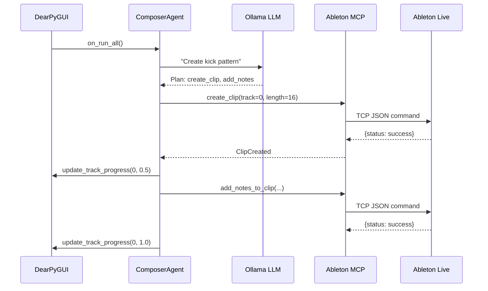

# Phase 5: DearPyGUI Controller Implementation

**Parent Spec**: [007_mvp_master_spec.md](file:///Users/alexzh/ableton-mcp/specs/active/007_mvp_master_spec.md)

## Overview

DearPyGUI provides a high-performance, cross-platform GUI framework for orchestrating Ollama/CrewAI agents.

---

## 1. Core Components

### 1.1 Main Application

```python
# scripts/dearpygui_controller/main.py
import dearpygui.dearpygui as dpg
from agents import ResearchAgent, ComposerAgent, MixerAgent, VerifierAgent
from callbacks import on_run_all, on_stop, on_reset

def create_gui():
    dpg.create_context()

    with dpg.window(label="I AM MACHINE Controller", tag="main"):
        # Agent Control Panel
        with dpg.child_window(label="Agents", width=200, height=150):
            dpg.add_checkbox(label="Research Agent", tag="agent_research")
            dpg.add_checkbox(label="Composer Agent", tag="agent_composer")
            dpg.add_checkbox(label="Mixer Agent", tag="agent_mixer")
            dpg.add_checkbox(label="Verifier Agent", tag="agent_verifier")

        # Track Progress Panel
        with dpg.child_window(label="Tracks", width=-1, height=250):
            for i, name in enumerate(TRACK_NAMES):
                dpg.add_progress_bar(label=name, tag=f"track_{i}", default_value=0)

        # Log Panel
        dpg.add_input_text(multiline=True, readonly=True, tag="log", width=-1, height=150)

        # Control Buttons
        with dpg.group(horizontal=True):
            dpg.add_button(label="▶ RUN ALL", callback=on_run_all)
            dpg.add_button(label="⏹ STOP", callback=on_stop)
            dpg.add_button(label="🔄 RESET", callback=on_reset)
            dpg.add_button(label="📊 VERIFY", callback=on_verify)

    dpg.create_viewport(title="I AM MACHINE", width=800, height=600)
    dpg.setup_dearpygui()
    dpg.show_viewport()
    dpg.start_dearpygui()
    dpg.destroy_context()

if __name__ == "__main__":
    create_gui()
```

### 1.2 Agent Integration

```python
# scripts/dearpygui_controller/agents/composer_agent.py
import asyncio
from crewai import Agent, Task, Crew, Process
from langchain_community.llms import Ollama
from live_set.lily_palmer.i_am_machine.ableton_client import AbletonMCPClient

class ComposerAgent:
    def __init__(self):
        self.ollama = Ollama(model="llama3", base_url="http://localhost:11434")
        self.mcp_client = AbletonMCPClient()

        self.agent = Agent(
            role='Techno Rhythm Programmer',
            goal='Create driving 4/4 patterns at 136 BPM in F Minor',
            backstory='''Expert drum programmer specializing in Peak Time Techno.
            You understand the physics of rumble kicks and 909 patterns.''',
            llm=self.ollama,
            verbose=True
        )

    async def create_kick_pattern(self):
        """Create 4-on-floor kick pattern."""
        task = Task(
            description='''
            Create a 4-bar 4-on-floor kick pattern:
            1. Ensure track 0 exists (01-Kick)
            2. Create clip at index 0, length 16 beats
            3. Add C1 (MIDI 36) on every beat (0, 1, 2, 3, 4...)
            4. Velocity: 110 for beats 1,3 and 100 for beats 2,4
            ''',
            expected_output="Kick pattern created and playing",
            agent=self.agent
        )

        crew = Crew(agents=[self.agent], tasks=[task], process=Process.sequential)
        return crew.kickoff()
```

---

## 2. Callback System

```python
# scripts/dearpygui_controller/callbacks/run_callbacks.py
import dearpygui.dearpygui as dpg
import asyncio
from agents import ComposerAgent, MixerAgent

_running = False
_current_task = None

def log(message: str):
    """Append message to log panel."""
    current = dpg.get_value("log")
    timestamp = datetime.now().strftime("%H:%M:%S")
    dpg.set_value("log", f"{current}[{timestamp}] {message}\n")

def update_track_progress(track_index: int, progress: float):
    """Update track progress bar."""
    dpg.set_value(f"track_{track_index}", progress)

async def run_all_tracks():
    """Orchestrate all agents to create the 16-track project."""
    global _running
    _running = True

    composer = ComposerAgent()
    mixer = MixerAgent()

    log("Starting I AM MACHINE recreation...")

    for i in range(16):
        if not _running:
            log("Stopped by user")
            break

        log(f"Processing track {i+1}/16...")

        # Composer creates pattern
        await composer.create_pattern_for_track(i)
        update_track_progress(i, 0.5)

        # Mixer applies effects
        await mixer.apply_chain_for_track(i)
        update_track_progress(i, 1.0)

        log(f"Track {i+1} complete")

    log("All tracks complete!")
    _running = False

def on_run_all():
    """Button callback for Run All."""
    asyncio.create_task(run_all_tracks())

def on_stop():
    """Button callback for Stop."""
    global _running
    _running = False
    log("Stopping...")

def on_reset():
    """Button callback for Reset."""
    for i in range(16):
        dpg.set_value(f"track_{i}", 0)
    dpg.set_value("log", "")
    log("Reset complete")
```

---

## 3. Agent Communication Flow



---

## 4. Configuration

```toml
# config/dearpygui_controller.toml
[ollama]
model = "llama3"
base_url = "http://localhost:11434"
temperature = 0.7

[ableton]
host = "127.0.0.1"
port = 9877
timeout = 15.0

[agents]
verbose = true
max_retries = 3

[tracks]
total = 16
tempo = 136.0
key = "F"
scale = "minor"
```

---

## 5. Testing

```python
# tests/test_dearpygui_controller.py
import pytest
from scripts.dearpygui_controller.agents.composer_agent import ComposerAgent

class TestComposerAgent:
    def test_agent_initialization(self):
        agent = ComposerAgent()
        assert agent.agent.role == 'Techno Rhythm Programmer'

    async def test_kick_pattern_format(self):
        agent = ComposerAgent()
        # Mock the MCP client
        pattern = agent.generate_kick_notes(bars=4)
        assert len(pattern) == 16  # 4 bars * 4 beats
        assert all(n['pitch'] == 36 for n in pattern)
```

---

## 6. Installation

```bash
# Add DearPyGUI to dependencies
uv add dearpygui>=2.0.0

# Verify installation
uv run python -c "import dearpygui.dearpygui as dpg; print(dpg.get_dearpygui_version())"

# Run controller
uv run python scripts/dearpygui_controller/main.py
```
